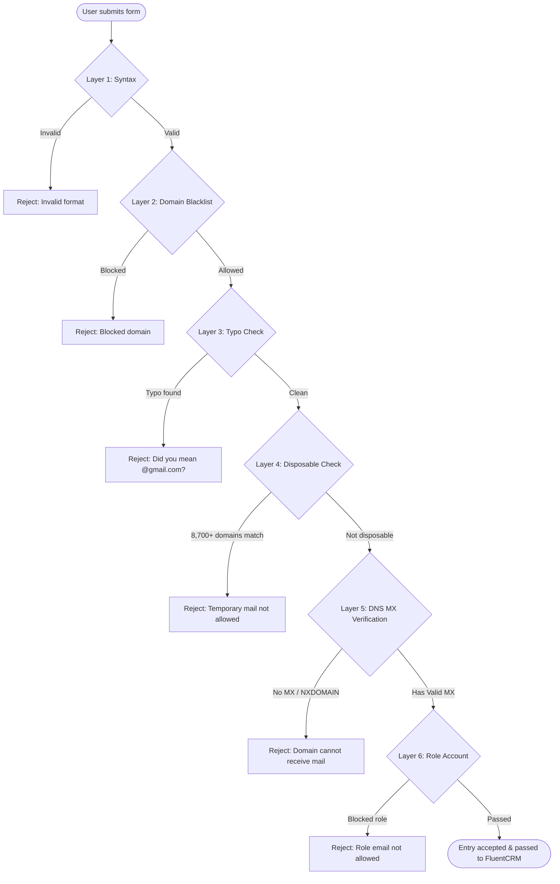

# Fluent Forms Email Guard & Anti-Bounce (`fluentform-email-guard`)

> Production-grade multi-layer real-time email defense, disposable domain filtration, live DNS MX verification, and auto-update distribution system for WordPress & Fluent Forms.

[](https://github.com/vecyang1/fluentform-email-guard/actions/workflows/ci-release.yml)
[](LICENSE)
[](https://wordpress.org/)
[](https://php.net/)

---

## 1. Overview & Architecture

When running marketing campaigns, lead funnels, and automated CRM onboarding sequences (e.g. FluentCRM, MailPoet, Sendinblue/Brevo), invalid email addresses, throwaway mailboxes, and typos cause catastrophic bounce rates. Hard bounces permanently ruin domain sender reputation, land marketing emails into spam folders, and trigger transactional rate-limiting.

`fluentform-email-guard` hooks directly into the core validation layer of Fluent Forms (`fluentform/validate_input_item_input_email`) to reject invalid, disposable, unroutable, and bounce-inducing emails *at form submission time*, before the entry is recorded or forwarded to marketing automations.



---

## 2. Six-Layer Defense Engine

| Layer | Type | Mechanism | Performance / Caching |
|---|---|---|---|
| **Layer 1** | RFC 5322 Syntax | Native `filter_var(..., FILTER_VALIDATE_EMAIL)` | < 0.1ms (in-memory) |
| **Layer 2** | Custom Domain Blacklist | Configurable blocked domains (e.g. competitors, abusive domains) | In-memory lookup |
| **Layer 3** | Typo Auto-Suggestion | Detects common typos (`gamil.com`, `outlok.com`, `hotmial.com`, etc.) and suggests correct spelling | In-memory string map |
| **Layer 4** | Disposable Domains | Built-in list + dynamic sync of **8,700+ active temporary mail domains** | Cached in `uploads/fluentform-email-guard/disposable_domains.json`, indexed via `array_flip` O(1) hash lookup |
| **Layer 5** | Live DNS MX Verification | Direct `checkdnsrr($domain, 'MX')` query to ensure destination mail server exists | Cached via WordPress Transient API (`ff_mx_...`) for 24 hours |
| **Layer 6** | Role-Based Account Filter | Optional filter for generic mailboxes (`admin@`, `support@`, `billing@`, etc.) | Configurable toggle |

---

## 3. WordPress Admin Dashboard

The settings and audit page is registered at:
**WordPress Admin > Fluent Forms > Email Guard** (URL: `/wp-admin/admin.php?page=fluentform-email-guard`)

### Key Features:
- **Interactive Live Sandbox**: Test any email in real-time with instant JSON diagnostic inspection before enabling rules globally.
- **Granular Toggles**: Selectively enable/disable MX validation, disposable filtration, typo suggestions, or role-based account blocking.
- **Custom Domain Rules**: Add custom blocked domains or whitelist critical corporate domains.
- **Recent Block Audit Logs**: Real-time audit table of the last 100 intercepted submissions with timestamp, email address, blocking reason, and form ID.
- **One-Click Disposable List Refresh**: Trigger immediate sync against upstream blocklists.
- **GitHub Update Authentication**: Enter private personal access token to allow automatic 1-click updates across your WordPress estate.

---

## 4. GitHub Releases Native Auto-Updater

This plugin implements WordPress's core update hooks (`pre_set_site_transient_update_plugins`, `plugins_api`, and `http_request_args`).

1. Releases are published as tagged GitHub Releases (e.g. `v1.1.0`) with `fluentform-email-guard.zip`.
2. When WordPress checks for plugin updates (or when you click **Check for Updates** in `Plugins > Installed Plugins`), the plugin queries `api.github.com/repos/vecyang1/fluentform-email-guard/releases/latest`.
3. If a newer version exists, WordPress displays the native **Update Now** notification.
4. For private repositories, enter a GitHub Personal Access Token (`repo` scope) in the plugin settings to authenticate download requests.

---

## 5. REST API & Uptime Kuma Health Check

The plugin exposes two lightweight public REST API endpoints:

### Health & Status Monitor:
```http
GET /wp-json/fluentform-email-guard/v1/status
```
**Response:**
```json
{
  "enabled": true,
  "version": "1.1.0",
  "disposable_domains_count": 8742,
  "blocked_domains": ["search-glintmuse.com", "q2.com"],
  "target_forms": [],
  "checks": {
    "syntax": true,
    "mx": true,
    "disposable": true,
    "typo": true,
    "blocked_domains": true,
    "role": false,
    "external_api": false
  },
  "recent_blocked_logs": [],
  "total_recent_blocks": 0
}
```

### Uptime Kuma Configuration:
- **Monitor Type**: HTTP(s) - Keyword
- **URL**: `https://<your-site>/wp-json/fluentform-email-guard/v1/status`
- **Keyword**: `"enabled":true`
- **Heartbeat Interval**: 60 seconds

### Live Email Test Endpoint:
```http
POST /wp-json/fluentform-email-guard/v1/test
Content-Type: application/json

{"email": "someone@invalid.test"}
```
**Response:**
```json
{
  "valid": false,
  "reason": "disposable",
  "message": "Temporary or disposable email addresses are not accepted."
}
```

---

## 6. Installation & Deployment

### Manual Installation
1. Download `fluentform-email-guard.zip` from [Releases](https://github.com/vecyang1/fluentform-email-guard/releases).
2. In WordPress admin, navigate to **Plugins > Add New > Upload Plugin**.
3. Choose the zip file and click **Install Now**, then **Activate Plugin**.

### Novamira MCP Fleet Deployment
```bash
# Verify plugin activation across estate
php -r "include_once 'fluentform-email-guard.php';"
```

---

## 7. Testing & Quality Assurance

The codebase adheres to Test-Driven Development (TDD) and contract verification:

```bash
# Run PHP syntax linter
php -l fluentform-email-guard.php

# Run full Python contract test suite
python3 -m unittest tests/test_email_guard_contract.py
```

---

## 8. License

Distributed under the **GPL-2.0-or-later** license. See `LICENSE` for details.
