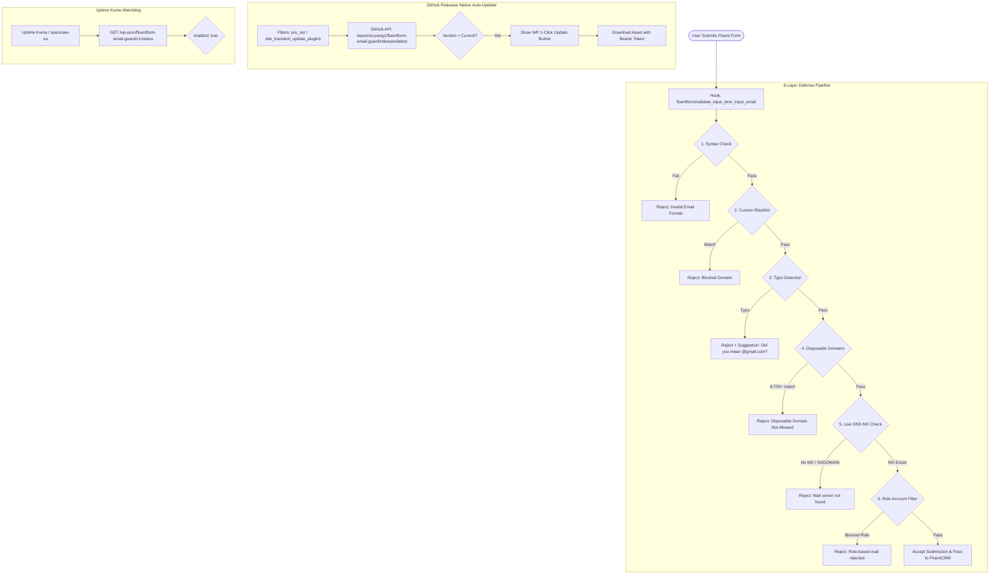

# System Architecture Map - 26.09.06-fluentform-email-guard

> Authoritative system architecture, data models, integration contracts, and deployment topology for `fluentform-email-guard`.

## App Summary

- **What this app does**: Production-grade multi-layer real-time email defense, disposable email filtration (8,700+ domains), live DNS MX verification with 24h caching, typo auto-suggestion, and WordPress auto-update distribution system.
- **Primary users**: WordPress estate administrators, marketing leads, growth engineers running Fluent Forms and FluentCRM funnels.
- **Core jobs**: Prevent invalid submissions, throwaway mailboxes, and typos at form submission time to eliminate hard bounces, protect SMTP domain sender reputation, and maintain CRM hygiene.
- **Out of scope**: Generic anti-spam CAPTCHA (handled by Turnstile), payment fraud (handled by Stripe/SureCart).
- **Current phase**: Production v1.1.1 deployed across estate (`glintmuse.com`, `xinchaovi.com`, `belovedpals.com`).
- **last_verified**: 2026-09-06

---

## System Diagram

---

## Module Map

| Module / Area | Owns | Reads | Writes | Public Contract | Source Paths |
|---|---|---|---|---|---|
| **Validation Engine** | Real-time email inspection, scoring, and rejection messages | `wp_options` (`fluentform_email_guard_config`), Transients | Transients (`ff_mx_*`), Audit logs | `fluentform/validate_input_item_input_email` | `fluentform-email-guard.php:gm_ff_email_guard_check` |
| **Disposable Domain Sync** | 8,700+ domain list synchronization | GitHub upstream list (`disposable_email_blocklist.conf`) | `uploads/fluentform-email-guard/disposable_domains.json` | `gm_ff_email_guard_sync_disposable_list()` | `fluentform-email-guard.php:126` |
| **Admin UI & Sandbox** | Fluent Forms submenu settings page, interactive email tester, block audit table | `wp_options`, Uploads dir | `wp_options` | `/wp-admin/admin.php?page=fluentform-email-guard` | `fluentform-email-guard.php:gm_ff_email_guard_render_admin_page` |
| **REST API** | Health status check and diagnostic test API | Plugin config, logs | None | `/wp-json/fluentform-email-guard/v1/status`, `/test` | `fluentform-email-guard.php:736` |
| **GitHub Auto-Updater** | Native 1-click updates from private repository | GitHub Releases API, personal access token | `update_plugins` transient | WordPress `Plugin_Upgrader` hooks | `fluentform-email-guard.php:798` |

---

## Data And Storage

| Store / Table / Collection | Owns | Key Entities | Producer | Consumer | Source Of Truth | Notes |
|---|---|---|---|---|---|---|
| `wp_options` (`fluentform_email_guard_config`) | Settings | `enabled`, `checks`, `blocked_domains`, `whitelist_domains`, `typo_domains`, `github_token` | Admin UI, MCP | Validator, Updater | Yes | Default config seeded on first load |
| `wp_options` (`fluentform_email_guard_logs`) | Audit trail | Last 100 blocked emails, reasons, timestamps, form IDs, IPs | Validator | Admin UI, REST API | Yes | Auto-trimmed to 100 rows |
| `wp_options` Transients (`ff_mx_<hash>`) | DNS MX cache | Domain MX status (true/false) | MX Validator | MX Validator | Derived | 24-hour TTL |
| Uploads JSON (`disposable_domains.json`) | Upstream blocklist | 8,700+ raw domain strings | WP-Cron weekly sync | Validator | Derived | Fast O(1) `array_flip` in-memory lookup |

---

## Integrations And External Services

| Service | Purpose | Auth / Secret Route | Owner Module | Failure Mode | Verification |
|---|---|---|---|---|---|
| **GitHub Releases API** | Private release distribution and zip asset downloads | GitHub PAT (`repo` scope) stored in config | Auto-Updater | 30-min backoff transient; plugin continues running | `gh release view v1.1.1` |
| **Upstream Disposable Blocklist** | Raw list of temporary email domains | Public HTTPS (`raw.githubusercontent.com`) | WP-Cron Sync | Fallback to built-in 24 domains if unreachable | `gm_ff_email_guard_sync_disposable_list()` |
| **Uptime Kuma** | Real-time health monitoring | Public REST endpoint keyword match | `kuma_apply.py` | Alerts via Slack / Discord if `"enabled": false` or down | `python3 kuma_apply.py` |

---

## Runtime And Deployment

| Surface | Runtime | Entry Command / URL | Config Source | Health Check | Owner |
|---|---|---|---|---|---|
| **Local dev** | PHP 8.2 / Python 3.11 | `python3 tests/test_email_guard_contract.py` | Local repository | PHP syntax & unittest | `A-coding/26.09.06-fluentform-email-guard` |
| **GitHub CI/CD** | GitHub Actions | Push to `main` or tag `v*` | `.github/workflows/ci-release.yml` | Lint + Test + Package | `vecyang1/fluentform-email-guard` |
| **Estate WordPress** | WordPress 6.x / PHP 8.2 | `/wp-admin/admin.php?page=fluentform-email-guard` | `fluentform_email_guard_config` | `/wp-json/fluentform-email-guard/v1/status` | `glintmuse.com`, `xinchaovi.com`, `belovedpals.com` |
