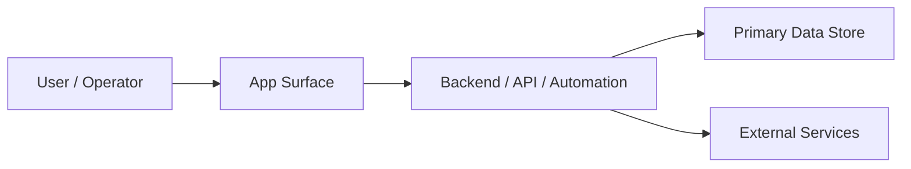

# System Architecture Map - 26.09.06-fluentform-email-guard

> One-page app/system map. Read this before database/schema spelunking, API
> tracing, feature planning, or architecture-impacting edits. Keep it concise
> enough that a future agent can understand what this app is without
> reverse-engineering tables, migrations, logs, or dashboards.

## App Summary

- What this app does:
- Primary users:
- Core jobs:
- Out of scope:
- Current phase:
- last_verified: TBD

## System Diagram

## Module Map

| Module / Area | Owns | Reads | Writes | Public Contract | Source Paths |
| --- | --- | --- | --- | --- | --- |
| TBD | TBD | TBD | TBD | TBD | TBD |

## Data And Storage

| Store / Table / Collection | Owns | Key Entities | Producer | Consumer | Source Of Truth | Notes |
| --- | --- | --- | --- | --- | --- | --- |
| TBD | TBD | TBD | TBD | TBD | TBD | TBD |

## Integrations And External Services

| Service | Purpose | Auth / Secret Route | Owner Module | Failure Mode | Verification |
| --- | --- | --- | --- | --- | --- |
| TBD | TBD | environment or secret manager name only | TBD | TBD | last_verified: TBD |

## Runtime And Deployment

| Surface | Runtime | Entry Command / URL | Config Source | Health Check | Owner |
| --- | --- | --- | --- | --- | --- |
| Local dev | TBD | TBD | `.env` / documented secret names only | TBD | TBD |
| Production | TBD | TBD | secret manager / deployment env | TBD | TBD |

## Update Triggers

Update this file in the same work block when any of these change:

- App purpose, user type, or core workflow.
- Module boundaries, exported APIs, shared schemas, or cross-module contracts.
- Database tables, migrations, storage buckets, queues, scheduled jobs, or caches.
- External integrations, auth/payment/AI providers, webhook routes, or secret names.
- Runtime, deployment path, health check, or environment/config ownership.

Do not reverse-engineer the app by crawling databases first. Read this file
before database/schema spelunking, then update it if the live system proves the
map is stale.

## Open Questions

- TBD
